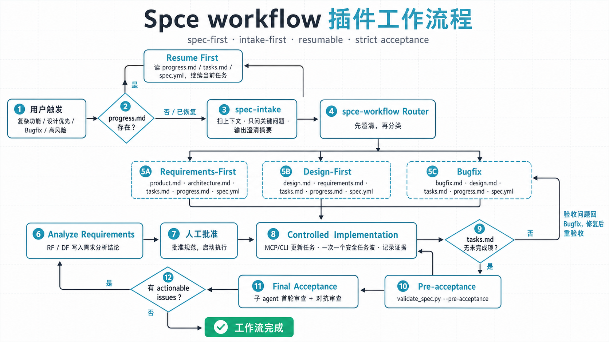

# Useful-marketplace

This repository provides plugin marketplace entries for `spec-workflow` and `nature-workflow`, usable from both Codex and Claude Code.

## Import in Claude Code

Add this repository as a plugin marketplace, then install a plugin:

```bash
/plugin marketplace add YGuo-2/Useful-marketplace
/plugin install nature-workflow@useful-marketplace
```

Claude Code reads the marketplace manifest at `.claude-plugin/marketplace.json` (repo root) and each plugin manifest at `plugins/<name>/.claude-plugin/plugin.json`. Skills under `plugins/<name>/skills/` are auto-discovered, and the bundled MCP server is wired through `${CLAUDE_PLUGIN_ROOT}` in the plugin's `.mcp.json` (`plugins/<name>/.mcp.json`). For `nature-workflow`, that host-specific config writes the memory discovery index and optional prose-style bootstrap to `CLAUDE.md`.

## Import in Codex

Use the Codex "Add plugin marketplace" dialog:

- Source: `YGuo-2/Useful-marketplace`
- Git ref: `main`
- Sparse path: leave empty

Codex expects the marketplace manifest at `.agents/plugins/marketplace.json` and each plugin manifest at `plugins/<name>/.codex-plugin/plugin.json`. `nature-workflow` declares its Codex-specific MCP entry inline, resolves the server relative to the installed plugin root, and keeps the memory index and optional prose-style bootstrap in `AGENTS.md`. Plugin sources live under `plugins/`.

## Plugins

- `spec-workflow`: spec-first development workflow for complex code changes.
- `nature-workflow`: Nature research skills with lightweight workflow tracking, paper memory, and optional reusable prose-style profiles.

## Nature Workflow


`nature-workflow` packages the usable skills from [`Yuan1z0825/nature-skills`](https://github.com/Yuan1z0825/nature-skills) into this marketplace while preserving shared dependencies and full skill subtrees such as `nature-academic-search/mcp-server`.

It includes these user-facing skills:

- `nature-academic-search`
- `nature-citation`
- `nature-data`
- `nature-figure`
- `nature-paper-to-patent`
- `nature-paper2ppt`
- `nature-polishing`
- `nature-prose-style`
- `nature-reader`
- `nature-response`
- `nature-reviewer`
- `nature-writing`

`skills/_shared` is preserved as support content for relative references and is not meant to be used as a standalone workflow.

The plugin is released under the MIT license and keeps the upstream [`Yuan1z0825/nature-skills`](https://github.com/Yuan1z0825/nature-skills) source structure for the packaged Nature skills.

The plugin also adds a small workflow state layer under `docs/nature-workflows/` by default. It is intentionally lighter than `spec-workflow`: no spec approval freeze, no acceptance rounds, no spec-style business-code commit guard, and no business-code enforcement. Each workflow has `nature.yml`, `progress.md`, and `tasks.md`; `nature.yml` keeps its historical name for compatibility, but its content is JSON. Read-only commands such as `status` and `resume` do not rewrite those files.

Each workflow can also keep paper-scoped memory beside those files: shared facts
live in `memory.md`, while untracked-and-ignored private facts may live in
`memory.local.md`. A level-2 heading is human-readable, but schema-v1 hidden JSON
metadata supplies an immutable `nm_` UUID4 identity, provenance, evidence,
confidence, lifecycle, and machine-generated timestamps. The physical file, not
metadata supplied by a caller, determines the scope.

Memory is low-trust project data. `list` and `recall` scan the canonical file at
read time; the host instruction file contains only a fixed discovery instruction and never
receives titles, body text, workflow names, or evidence. Recall is deterministic,
lexical, bounded to 3 results by default (5 maximum) and 4096 UTF-8 bytes.
Writes use an explicit workflow and scope, a workflow lock, entry/file ETags,
and an atomic replacement. Local mutation is fail-closed unless Git proves that
the file is both untracked and ignored.

Reusable prose-style profiles are strictly opt-in: `nature-prose-style` creates
one only when the user explicitly asks to generate or save a persistent style
profile from a complete English article or article set. Ordinary writing,
polishing, generic "Nature style", and transient tone requests do not create a
profile. Once a profile passes validation and becomes usable, writing and
polishing resolve it automatically. One usable profile is auto-selected; two or
more usable profiles pause prose work and require the user to choose an exact
profile. The selected profile and its default/section/one-turn selection mode are treated as low-trust data, and a bound audit
receipt records their application without allowing style to override facts,
numbers, units, citations, terminology, causality, or claim strength. The audit
requires the ETags returned before writing plus an explicit operation and passed semantic checks; polishing also binds a separate normalized UTF-8
source file. Codex installs the fixed discovery block in `AGENTS.md`, while
Claude installs it in `CLAUDE.md`; disabling the final usable profile removes the managed block from both files when present.

CLI examples:

```bash
python plugins/nature-workflow/scripts/nature_progress.py new --slug "paper-reader"
python plugins/nature-workflow/scripts/nature_progress.py discover
python plugins/nature-workflow/scripts/nature_progress.py status
python plugins/nature-workflow/scripts/nature_progress.py start T1
python plugins/nature-workflow/scripts/nature_progress.py complete T1 --evidence "reader exported"
python plugins/nature-workflow/scripts/nature_progress.py block T2 --reason "waiting for source PDF"
python plugins/nature-workflow/scripts/nature_progress.py resume
python plugins/nature-workflow/scripts/nature_memory.py list --workflow <workflow-dir>
python plugins/nature-workflow/scripts/nature_memory.py migrate --workflow <workflow-dir> --dry-run
python plugins/nature-workflow/scripts/nature_memory.py check --workflow <workflow-dir>
python plugins/nature-workflow/scripts/nature_memory.py index --root docs/nature-workflows
```

MCP tools are exposed through `plugins/nature-workflow/mcp/nature_progress_server.py`:

- `nature_new_workflow`
- `nature_discover_workflows`
- `nature_status`
- `nature_resume`
- `nature_start_task`
- `nature_complete_task`
- `nature_block_task`
- `nature_log_note`
- `nature_style_validate`
- `nature_style_register`
- `nature_style_select`
- `nature_style_resolve`
- `nature_style_audit`
- `nature_style_disable`
- `nature_style_index`
- `nature_memory_check`
- `nature_memory_touch`
- `nature_memory_index`
- `nature_memory_list`
- `nature_memory_remember`
- `nature_memory_recall`
- `nature_memory_show`
- `nature_memory_forget`
- `nature_memory_supersede`
- `nature_memory_consolidate_plan`
- `nature_memory_consolidate_apply`
- `nature_memory_migrate`
- `nature_resume_with_memory`
- `nature_complete_with_memory_review`
- `nature_block_with_memory_review`

When calling these MCP tools from a project, pass `project_root` to anchor the default `docs/nature-workflows/` directory in that project instead of the plugin directory.

The old `check`, `touch`, `index`, and `list` operations remain as additive
compatibility shims. `touch` only maintains legacy timestamp comments; canonical
schema-v1 writes go through `nature_memory_remember` or the Python API. Legacy
files are read without modification and require an explicit `migrate` dry-run and
per-workflow migration.

A pre-commit hook template for memory linting lives at:

```text
plugins/nature-workflow/assets/hooks/pre-commit-nature-memory
```

This hook only lints `memory.md` and is advisory — it prints warnings but never
blocks a commit.

## What It Does

`spec-workflow` is a spec-first workflow for changes where correctness, scope control, resumability, and reviewability matter more than speed.

It includes seven skills:

- `spec-intake`: inspect context first, then run a multi-round clarification gate with an explicit handoff.
- `spec-workflow`: route the request to the right workflow branch.
- `spec-requirements-analysis`: run Kiro-style Analyze Requirements before artifact generation.
- `spec-requirements-first`: create product-led feature specs.
- `spec-design-first`: create design-led specs from fixed architecture or technical constraints.
- `spec-bugfix`: create evidence-led bugfix specs before code changes.
- `spec-acceptance`: run final multi-agent acceptance after all approved tasks are complete.

Use it for complex features, cross-module refactors, design-first work, regressions, production fixes, or high-risk changes. For tiny local edits, the workflow can be heavier than the task; low-risk work can opt into Quick Plan only with explicit human authorization.

## Workflow



Generated artifacts live in an isolated workflow directory under `docs/specs/<run-id>/`; chat-only plans are not the source of truth. Legacy root-level `docs/specs/tasks.md` workflows remain readable, but new workflows must not write to the root directory.

1. Discover workflow directories first with `spec_progress.py discover docs/specs/`.
   - If open workflows exist, list them and ask whether to continue one or create a new workflow.
   - If no open workflow exists, create a new isolated directory with `spec_progress.py new docs/specs/ --slug "<short-slug>"`.
2. Intake clarifies goal, scope, risk, non-goals, decision boundaries, and acceptance criteria. It may ask multiple focused rounds and hands off only when status is `complete` or `assumptions-accepted`.
3. Router selects one branch:
   - Requirements-First: product goal or new capability without fixed technical design.
   - Design-First: architecture, ADR, HLD/LLD, or fixed technical approach drives the work.
   - Bugfix: restore existing expected behavior with evidence and regression protection.
4. Requirements-First and Design-First run Analyze Requirements before finalizing specs.
5. The selected branch writes Markdown artifacts plus:
   - `<specs_dir>/tasks.md`: human-readable task source of truth.
   - `<specs_dir>/progress.md`: resume entrypoint after interruption, shutdown, or lost thread.
   - `<specs_dir>/spec.yml`: Kiro-compatible machine index for workflow, artifacts, approval, risk, requirement IDs, task graph, current task, `artifact_hashes`, and `task_plan_hash`.
6. After human approval, `spec_progress.py approve` or MCP `spec_approve` freezes the approved spec and task-plan baseline.
7. Implementation proceeds through Spec Progress CLI/MCP task updates, one safe task wave at a time.
8. When no unchecked tasks remain, local pre-acceptance runs before strict final multi-agent acceptance.

Task plans must meet a quality bar before approval: each task declares `接口` fields (consumed and produced signatures, `无` when empty) so a context-free executor can run it alone, placeholder text like `TBD` or `类似 T-xxx` counts as a plan failure, and the plan is self-reviewed for requirement coverage and cross-task interface consistency. During implementation, each task must pass a two-phase review — spec compliance plus code quality, preferably by a fresh review subagent that sees only the task, spec excerpts, and diff — before `complete`. The Bugfix branch additionally enforces a root-cause investigation discipline: no fix proposals before evidence-backed root-cause analysis, one written hypothesis per self-healing loop, and a hard stop with human escalation after three failed loops.

The preferred implementation approval phrase for every branch is:

```text
批准规范，启动执行
```

Legacy phrases remain valid for compatibility:

```text
批准 design-first 规范，启动执行
批准 bugfix 规范，启动执行
```

Passing validation is not approval. The human approval phrase plus the `approve` command are required before writing business source code.

## Git Delivery Chain

When a workflow runs inside a git repository, `spec-workflow` wraps it in a branch-and-PR delivery chain anchored at the workflow level. It creates an isolated `git worktree` on a `spec/<run-id>` branch so the main working tree stays clean, opens a draft PR after approval whose checklist mirrors `tasks.md`, and commits each completed task (business code plus progress files) so the PR reads as a live review board. After final acceptance the draft is marked ready for review, and the agent only prints the suggested merge and `git worktree remove` commands for a human to run — it never merges autonomously. The chain degrades gracefully: no `git worktree` falls back to `git switch -c`, no remote or `gh` keeps everything local and skips the PR steps, and a non-git repository behaves exactly as before. Tracking issues are created only on request, with the PR linked via `Closes #N`.

## Kiro Compatibility

The plugin keeps its existing Markdown strengths while adding a machine-readable index:

- Requirements-First keeps `product.md + architecture.md + tasks.md`.
- Design-First keeps `design.md + requirements.md + tasks.md`.
- Bugfix keeps `bugfix.md + design.md + tasks.md`.
- `spec.yml` maps those artifacts into Kiro-style workflow metadata: `workflow`, `mode`, `approval`, `risk_level`, `artifacts`, `requirements`, `task_ids`, `task_graph`, `current_task`, `artifact_hashes`, and `task_plan_hash`.

`product.md`, `requirements.md`, and `bugfix.md` include an `Intake Handoff / 澄清交接` section. `product.md` and `requirements.md` include an `Analyze Requirements / 需求分析结论` section for ambiguity, conflicts, intake unresolved-item classification, missing boundaries, failure paths, permissions, concurrency, data consistency, and risk checks.

## Progress And Resume

Task state is enforced through `<specs_dir>/tasks.md`, `<specs_dir>/progress.md`, and `<specs_dir>/spec.yml`.

Use the CLI directly:

```bash
python plugins/spec-workflow/scripts/spec_progress.py discover docs/specs/
python plugins/spec-workflow/scripts/spec_progress.py new docs/specs/ --slug "comments-api"
python plugins/spec-workflow/scripts/spec_progress.py init <specs_dir>
python plugins/spec-workflow/scripts/spec_progress.py approve <specs_dir> --evidence "批准规范，启动执行"
python plugins/spec-workflow/scripts/spec_progress.py status <specs_dir>
python plugins/spec-workflow/scripts/spec_progress.py resume <specs_dir>
python plugins/spec-workflow/scripts/spec_progress.py start <specs_dir> T-001
python plugins/spec-workflow/scripts/spec_progress.py complete <specs_dir> T-001 --evidence "pytest tests/test_feature.py passed"
python plugins/spec-workflow/scripts/spec_progress.py block <specs_dir> T-001 --reason "needs API decision"
python plugins/spec-workflow/scripts/spec_progress.py skip <specs_dir> T-001 --approval "human approved skip"
python plugins/spec-workflow/scripts/spec_progress.py waves <specs_dir>
python plugins/spec-workflow/scripts/spec_progress.py sync-check <specs_dir>
python plugins/spec-workflow/scripts/spec_progress.py pre-acceptance <specs_dir>
python plugins/spec-workflow/scripts/spec_progress.py acceptance-init <specs_dir>
python plugins/spec-workflow/scripts/spec_progress.py acceptance-status <specs_dir>
python plugins/spec-workflow/scripts/spec_progress.py acceptance-plan-fixes <specs_dir>
python plugins/spec-workflow/scripts/spec_progress.py acceptance-next-round <specs_dir>
python plugins/spec-workflow/scripts/spec_progress.py acceptance-finish <specs_dir>
```

`approve` records the human approval and freezes the baseline. `complete` requires verification evidence. `skip` requires explicit human approval evidence. Task updates also synchronize the top-level `tasks.md` status, current task, progress count, and completion log. If a task is active and the worktree has business-code changes after an interruption, `resume` reports `interrupted`; the next agent must inspect the diff and evidence before continuing.

After approval, primary spec artifacts and the task plan are immutable. Progress updates may change checkbox/status/evidence/completed_at/notes/blocker, top-level progress summary, completion log, `progress.md`, and current-task/index state. If requirements, design, root cause, or task plan must change, run `sync-check --write` to mark `reapproval-required`, update specs, obtain a new approval, and run `approve` again.

## MCP Tools

The plugin includes `.mcp.json` and a stdio server at `mcp/spec_progress_server.py`. The MCP tools wrap the same state machine as the CLI:

- `spec_status`
- `spec_resume`
- `spec_discover_workflows`
- `spec_new_workflow`
- `spec_approve`
- `spec_start_task`
- `spec_complete_task`
- `spec_block_task`
- `spec_skip_task`
- `spec_acceptance_init`
- `spec_acceptance_status`
- `spec_acceptance_start_agent`
- `spec_acceptance_complete_agent`
- `spec_acceptance_record_issue`
- `spec_acceptance_plan_fixes`
- `spec_acceptance_fix_start`
- `spec_acceptance_fix_complete`
- `spec_acceptance_next_round`
- `spec_acceptance_finish`

Agents should use MCP task tools when available. The CLI is the fallback and remains the canonical implementation.

When launching the Spec MCP server outside the Codex plugin runtime, set `SPEC_WORKFLOW_BASE_DIR` to the project root so relative `specs_dir` values resolve under the target project rather than the plugin directory. The legacy `SPEC_CODING_BASE_DIR` variable is still accepted as a compatibility fallback.

## Hook Guard

A pre-commit hook template lives at:

```text
plugins/spec-workflow/assets/hooks/pre-commit-spec-progress
```

Install it into a target repository by copying it to `.git/hooks/pre-commit` and making it executable. It scans `docs/specs/` for open workflows, including legacy root-level specs and `docs/specs/<run-id>/` directories, and blocks commits that stage business-code changes while the matching workflow progress files are unchanged.

## Validation

Run the structural validator against the generated specs:

```bash
python plugins/spec-workflow/scripts/validate_spec.py <specs_dir> --workflow requirements-first
python plugins/spec-workflow/scripts/validate_spec.py <specs_dir> --workflow design-first
python plugins/spec-workflow/scripts/validate_spec.py <specs_dir> --workflow bugfix
```

`--workflow auto` is the default when the directory contains exactly one recognizable artifact set.

The validator checks required files, unresolved template placeholders, formal GWT lines, branch-specific task IDs, LLD depth rules, basic structural sections, Analyze Requirements, task graph fields, and progress/index consistency when `spec.yml` or `progress.md` exists. It does not prove semantic quality, root-cause correctness, minimal scope, test strength, or safe rollout.

Color output defaults to `auto` and can be controlled with:

```bash
python plugins/spec-workflow/scripts/validate_spec.py <specs_dir> --color never
```

Progress and acceptance checks:

```bash
python plugins/spec-workflow/scripts/validate_spec.py <specs_dir> --progress
python plugins/spec-workflow/scripts/validate_spec.py <specs_dir> --resume
python plugins/spec-workflow/scripts/validate_spec.py <specs_dir> --sync-check
python plugins/spec-workflow/scripts/validate_spec.py <specs_dir> --pre-acceptance
```

## Final Acceptance

Final acceptance is intentionally strict. Local `pre-acceptance` may verify readiness when sub-agents are unavailable, but it is not final acceptance. Strict final acceptance requires explicit authorization to orchestrate sub-agents for first-wave review and adversarial review. If the current environment cannot run sub-agents, the workflow is blocked at acceptance; it must not be downgraded to a single-agent self-review or reported as complete.

Acceptance is resumable through `<specs_dir>/acceptance_state.json`. The state file freezes the original `tasks.md` task IDs, records review units, tracks which sub-agents are planned/running/completed, and records issue/fix/deferred status. After context compaction or interruption, agents must run `acceptance-status` and resume only the missing agents instead of rebuilding all review units.

Confirmed acceptance issues are repaired through `<specs_dir>/acceptance-fixes.md`, not by appending tasks to the original `<specs_dir>/tasks.md`. Rounds 1-3 may fix all evidence-backed actionable issues. From round 4 onward, only P0-P2 issues are auto-fixed; P3/P4 issues are deferred unless a human upgrades them. Round 6 is the hard stop for unresolved P0-P2 issues.

## High-Risk Work

Authentication, authorization, payments, billing, database schema changes, data repair, distributed consistency, cache consistency, secrets, encryption, sensitive data, incidents, rollback, and hotfix work require a visible warning and human deep review before merge.

## Development Checks

Useful local checks for this repository:

```bash
python -m py_compile plugins/spec-workflow/scripts/validate_spec.py
python -m py_compile plugins/spec-workflow/scripts/spec_progress.py
python -m py_compile plugins/spec-workflow/mcp/spec_progress_server.py
python plugins/spec-workflow/scripts/validate_spec.py --help
python plugins/spec-workflow/scripts/test_validate_spec.py
python -m json.tool plugins/spec-workflow/.codex-plugin/plugin.json
python -m json.tool plugins/spec-workflow/.mcp.json
git diff --check
```

For a spec directory that has entered final acceptance, also run:

```bash
python plugins/spec-workflow/scripts/spec_progress.py acceptance-status <specs_dir>
```
