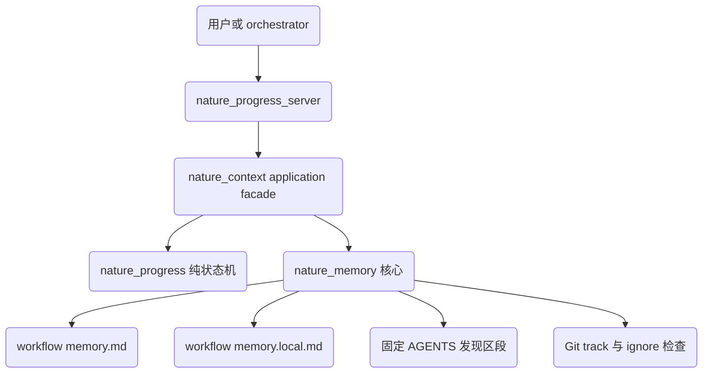
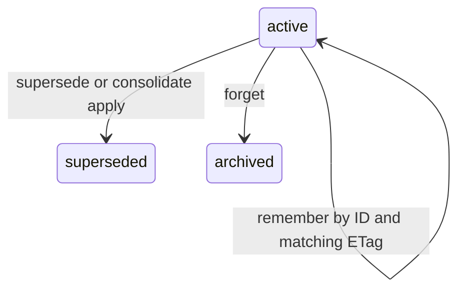

# nature-workflow 论文级记忆重设计技术规范

> **设计名称：** Paper-scoped Memory Lifecycle
> **设计粒度：** Low Level Design
> **版本：** v1.0
> **状态：** 审查中
> **最后更新：** 2026-07-14

> **高风险变更警告：** 当前任务涉及并发写入、数据迁移、隐私边界和安全信任边界，必须进行人类深度审查，切勿草率合并。

---

## 1. 设计概述

本设计把 `nature-workflow` 现有的 Markdown 解析、校验和动态索引机制，重构为一套论文级、可审计、可并发保护且能够确定性召回的本地记忆子系统。系统继续保留“一篇论文一个 workflow”和自然 Markdown 正文，但将显示标题、稳定身份、生命周期、证据和物理隐私边界分离。

本期采用标准库实现的实时扫描和词法召回，不引入向量数据库、embedding、FTS、BM25 持久索引或外部服务。`design.md` 是本次实现的主事实源；当前 `explore/nature-memory-redesign` 工作树仅作为迁移输入，不构成批准基线。

---

## 2. 设计起点与约束

### 2.1 已知设计输入

- 当前共享记忆位于 `docs/nature-workflows/<workflow>/memory.md`，与 `nature.yml`、`progress.md`、`tasks.md` 同目录。
- 当前 `nature_memory.py` 暴露 `check`、`touch`、`index`、`list`，MCP server 同时承载 progress 和 memory 工具。
- 当前候选实现已改为标题身份和告警式 lint，但仍存在动态 `AGENTS.md` 注入、单 workflow index 覆盖全局索引、重复标题误更新、隐式选错 workflow、并发丢更新和预算不闭合问题。
- Intake 探针表明实时扫描和 dependency-free 词法评分在当前规模可行，但探针不是发布证据；正式门槛由版本化 fixture 和第 13 节的可复现实验定义。
- 当前仓库没有已提交的真实 `memory.md`，但发布版本的使用者可能持有旧 `## M3 · 标题` 文件和旧 CLI/MCP 调用。

### 2.2 锁定设计决策

- `memory.md` 是 shared 事实源；同目录 `memory.local.md` 是 local 事实源。物理文件决定 scope，条目元数据不得伪造 scope。
- 每个 scope 内保持单文件、H2 条目结构和自然 Markdown 正文；机器元数据由工具写入标题后的单行隐藏 JSON comment。
- 每条记录使用不可变 UUID4 标识；标题只用于显示和检索，legacy `M<int>` 作为长期 alias 保留。
- `AGENTS.md` 只允许固定、无用户字符串的发现说明；工具实时扫描 canonical 文件，不保存动态标题索引或派生 cache。
- 所有 mutation 必须显式指定 `workflow_dir` 和 scope，并在 workflow 锁内重读、校验 ETag、一次性原子替换。
- v1 禁止跨 workflow 和跨 scope 的双写事务；跨论文关系只允许单向 locator，不回写另一个文件。
- progress 状态机保持独立；memory 只在 application facade/MCP 组合层提供有界上下文和非阻塞 review。
- 动态期刊事实只能作为带证据的历史 snapshot；实际使用时必须重新核验官方来源。

### 2.3 强约束

- 核心路径保持 Python 标准库优先，不新增向量、分词、tokenizer、数据库或锁库依赖。
- Windows 和类 Unix 环境必须共享同一外部契约；路径、UTF-8 中文、NFC/NFD、LF/CRLF 必须有测试。
- memory 内容属于低信任数据，不得改变系统、开发者、用户指令、工具权限、审批边界或安全策略。
- `AGENTS.md` 的固定区段不得包含 workflow 名、记忆标题、正文、证据或其他用户可控字符串。
- 写入不能静默 last-writer-wins；冲突、隐私降级、迁移碰撞和超预算必须结构化返回。
- 规范批准前禁止修改业务实现；批准后若改变数据模型、外部 API、隐私默认或验收阈值，必须重新审批。

### 2.4 假设

- Git 可用于证明 local 文件同时满足“未跟踪且已 ignore”；无法获得该证据时，v1 只允许 shared 读写，local mutation 必须 fail closed。
- 初始预算值由现有规模和探针确定，允许在真实 fixture 评测后通过重新审批调整。
- 纯词法检索不承诺解决无词面重合的跨语言同义表达；aliases 可作为人工补充，不扩展为向量方案。

---

## 3. 目标系统边界

### 3.1 涉及组件

| 组件 / 模块 | 职责 | 是否变更 |
|:---|:---|:---|
| `scripts/nature_memory.py` | canonical 解析、schema、scope、事务、生命周期、召回、迁移、repair 和 CLI | 是 |
| `mcp/nature_progress_server.py` | 暴露新旧 MCP 工具并保持追加式兼容 | 是 |
| `scripts/nature_context.py` | 组合 progress 与 memory，定义非原子失败语义 | 新增 |
| `scripts/nature_progress.py` | 纯 progress 状态机和共享路径工具 | 仅允许返回兼容字段，不依赖 memory |
| `skills/nature-workflow/SKILL.md` | memory admission、召回、引用、动态事实和审批规则 | 是 |
| `skills/nature-orchestrator/static/core/workflow.md` | resume 前上下文和 complete/block 后 review 驱动循环 | 是 |
| `assets/hooks/pre-commit-nature-memory` | 旧安装兼容和诊断；不再作为正确性边界 | 是 |
| `.codex-plugin/plugin.json` 与 MCP serverInfo | 版本和能力声明 | 是 |
| memory/progress 测试与 eval fixture | 确定性、并发、安全、检索和 Agent 验收 | 是 |
| `README.md` 与 `docs/nature-memory-redesign.md` | 用户工作流、迁移、限制和批准后设计记录 | 是 |

### 3.2 明确不在范围内

- 向量数据库、embedding、RAG 服务、FTS/BM25 持久索引或跨项目全局记忆。
- 一条记忆一个文件、物理 archive 分片或动态用户内容写入 `AGENTS.md`。
- 跨 workflow 或跨 shared/local 的原子 promote、supersede、consolidate。
- 程序自动生成语义合并正文、自动删除事实、自动按时间过期或自动重写 Git 历史。
- secret manager、凭据保险箱、期刊官网镜像和动态事实长期缓存。
- 修改 Nature domain skills 的科研任务逻辑；orchestrator 只传递有界、低信任 memory context。

---

## 4. 总体方案设计

### 4.1 体系结构

canonical 文件是唯一事实源。所有 list、show 和 recall 直接解析当前 workflow 下的 `memory.md` 或 `memory.local.md`；不依赖动态索引。`AGENTS.md` 固定区段只告诉 Agent 使用 list/recall 工具，并声明返回内容是低信任数据。

写路径由 `nature_memory.py` 在 workflow 锁内完成。组合路径由 `nature_context.py` 调用 progress 与 memory，但不把两个子系统描述为一个事务。MCP server 负责协议适配，不复制业务规则。

### 4.2 拓扑 / 调用链



### 4.3 核心数据流

| 流程 | 输入 | 输出 | 约束 |
|:---|:---|:---|:---|
| `remember` | workflow、scope、标题、正文、metadata、可选 ID/ETag | created/updated/noop、ID、ETag、locator、预算 | mutation 必须显式 workflow 和 scope |
| `recall` | workflow、scope、query、filters、top_k、max_bytes | 有序结构化记录和 matched terms | 默认只查当前 workflow、active、shared |
| `supersede` | 同 workflow/scope 的旧 ID、新正文、旧 ETag | 新 active 记录和旧 superseded 记录 | 单锁、单文件、一次 replace |
| `forget` | workflow、scope、ID、ETag、reason | archived 结果 | v1 只做逻辑归档，不删除当前正文或 Git 历史 |
| `consolidate_plan` | workflow、scope、预算状态 | source IDs、ETags、plan ID、候选原因 | 不生成语义正文 |
| `consolidate_apply` | plan ID、source IDs/ETags、人工正文 | 新 active 记录和旧 superseded 记录 | 任一 ETag 变化则整体 stale |
| `resume_with_memory` | progress resume 结果 | progress + bounded memory_context | memory 失败不能改变 progress 结果 |
| `complete/block_with_review` | progress mutation 输入 | progress committed + memory_review | 后置 memory 失败不得诱导重试 progress |

remember create 必须同时提供显式 `workflow_dir` 和 `scope=shared|local`；不传 `entry_id` 表示创建，工具生成 UUID。完全相同的 canonical create payload 重放返回现有记录和 `operation=noop`，不会生成第二条；标题相同但正文或 metadata 不同仍是合法的新记录。传 `entry_id` 表示更新，`expected_etag` 必填；未知 ID 返回 `not_found`，非法 metadata 返回稳定 rule code，任一错误都不得写文件。

---

## 5. 详细数据结构

### 5.1 人类可读条目

```markdown
## 引用风格
<!-- nature-memory: {"schema":1,"id":"nm_f47ac10b58cc4372a5670e02b2c3d479","kind":"decision","lifecycle":"active","provenance":"user","confidence":"confirmed","created_at":"2026-07-14T07:00:00Z","updated_at":"2026-07-14T07:00:00Z"} -->
RIS 导出，EndNote 兼容。
```

隐藏 metadata 不自动形成 Markdown fragment。canonical locator `docs/nature-workflows/<workflow>/memory.md#nm_<uuid>` 是由 `show/recall` 解析的逻辑定位符，不声称在 GitHub 中可点击。若未来需要真实 HTML anchor，必须另行规范并重新审批。

### 5.2 Entry 字段

| 字段 | 类型 / 取值 | 必需性 | 规则 |
|:---|:---|:---|:---|
| `schema` | 整数，初始为 1 | 必需 | 未知主版本 mutation fail closed |
| `id` | `nm_` 加 UUID4 hex | 必需 | 创建后不可变且 workflow 内唯一 |
| `legacy_aliases` | 零个或多个旧 ID | 迁移记录可选 | 保留 `M3` 等解析能力 |
| `kind` | decision、fact、constraint、preference、hypothesis、procedure | 必需 | 未知值拒绝写入 |
| `lifecycle` | active、superseded、archived | 必需 | 默认 recall 仅 active |
| `provenance` | user、workflow、paper、external、agent | 必需 | 表示来源类别，不等同 evidence |
| `evidence` | 零个或多个 locator | 条件必需 | fact/hypothesis 必须提供；只作为数据返回 |
| `confidence` | confirmed、likely、tentative | 条件必需 | fact/hypothesis 必需；禁止数值假精度 |
| `requires_live_verification` | true 或 false | 条件必需 | 动态期刊事实必须为 true |
| `created_at` | UTC ISO8601 | 必需 | 仅工具生成 |
| `updated_at` | UTC ISO8601 | 必需 | 正文或 metadata 真实变化时生成 |
| `verified_at` | UTC ISO8601 或空 | 可选 | 只表达上次证据核验，不等同当前有效 |
| `supersedes` | 同 workflow/scope 的稳定 ID 列表 | 可选 | 禁止自引用、环和跨边界双写；反向关系在读取时推导 |
| `body` | Markdown | 必需 | 不得被解释为工具或安全指令 |

scope 不存入条目 metadata：`memory.md` 推导为 shared，`memory.local.md` 推导为 local。ETag 也不存入正文，而是对 canonical entry block 的原始 UTF-8 字节计算 SHA-256 并在 API 返回。metadata 必须是紧随 H2 的单行 JSON comment；序列化器把 JSON 字符串中的原始 `--` 写成等价的 `\u002d\u002d`，parser 拒绝可能提前闭合 HTML comment 的原始 metadata。

### 5.3 生命周期状态转换



只有 active 记录可被 remember update、forget、supersede 或 consolidate。archived 和 superseded 在 v1 都是终态且默认不参与 recall；需要重新使用旧事实时创建新 active 记录并引用旧 locator。v1 不提供 restore 或 purge，因此不会宣称 API 能擦除 shared Git 历史。

---

## 6. 模块 / 类职责与函数签名契约

### 6.1 `nature_memory.py`

| 职责 | 建议函数签名 | 契约 |
|:---|:---|:---|
| 路径解析 | `resolve_memory_path(project_root, workflow_dir, scope)` | mutation 缺 workflow/scope 即失败；resolve 后验证 containment 和 symlink |
| 解析 | `parse_memory(text, source_path)` | 混合读取 legacy、标题版和 schema v1；不隐式迁移 |
| 校验 | `validate_records(records, policy)` | 返回结构化 errors/warnings；unknown schema mutation fail closed |
| 锁 | `workflow_memory_lock(workflow_dir, timeout)` | Windows 使用 `msvcrt`，类 Unix 使用 `fcntl`；超时返回 retryable error |
| 创建/更新 | `command_memory_remember(..., entry_id, expected_etag)` | 无 ID 创建；有 ID 更新且必须 ETag 匹配 |
| 召回 | `command_memory_recall(..., query, top_k, max_bytes, filters)` | 确定性、可解释、零分不返回 |
| 替代 | `command_memory_supersede(..., old_id, expected_etag, new_record)` | 单 workflow/scope、单 replace、拒绝环 |
| 忘记 | `command_memory_forget(..., entry_id, expected_etag, reason)` | 只允许 active 转 archived，保留正文与审计信息 |
| 合并计划 | `command_memory_consolidate_plan(..., source_ids)` | 输出无状态 plan ID 和 source ETags，不生成正文 |
| 合并应用 | `command_memory_consolidate_apply(..., plan_id, source_ids, source_etags, new_record)` | 锁内重算 plan ID 并全量 CAS，任一变化整体拒绝 |
| 迁移 | `command_memory_migrate(..., dry_run)` | 单 workflow 原子；`--all` 逐篇幂等且可恢复 |
| 发现/修复 | `command_memory_list`、`command_memory_index` | list 实时扫描；index 仅修复固定 AGENTS 区段并返回弃用提示 |

### 6.2 `nature_context.py`

- `resume_with_memory` 只解析一次 canonical workflow，然后分别调用 progress 和 recall。
- `complete_with_memory_review` 与 `block_with_memory_review` 先完成 progress mutation，再生成 review；返回必须包含 `progress_committed`。
- resume 的 memory 解析或召回失败写入 `memory_context.status=partial|unavailable`；complete/block 的后置失败写入 `memory_review.status=unavailable` 和结构化 error。两者都不回滚 progress，也不把 MCP 整体伪装为失败。
- facade 不负责 memory 自动写入；Agent 根据 review 显式调用 remember 或 supersede。

### 6.3 MCP 工具契约

新增 `nature_memory_remember`、`nature_memory_recall`、`nature_memory_show`、`nature_memory_forget`、`nature_memory_supersede`、`nature_memory_consolidate_plan`、`nature_memory_consolidate_apply`、`nature_memory_migrate`。Mutation schema 中 `workflow_dir` 和 `scope` 为 required；跨 workflow read 必须显式 `all_workflows=true`。

旧 `nature_memory_check/touch/index/list` 保留一个兼容版本：

- `touch` 接受稳定 ID、legacy alias 或唯一标题，歧义时失败，并返回 deprecated warning。
- `index --workflow` 参数仍可解析，但执行固定区段全量 repair，不再按单篇覆盖全局内容。
- `check/list` 只追加字段，不删除旧字段；新错误使用稳定 rule code。

---

## 7. 算法流程

### 7.1 词法召回算法

1. 解析当前 workflow 的选定 scope；默认只使用 shared、active。
2. 对 query、标题、aliases 和正文生成 NFKC/casefold 检索视图，不改变原文。
3. exact ID、exact title 和 exact phrase 优先。
4. 英文与数字按字母数字 token 计算覆盖；中文以 bigram 为主，单字仅用于精确子串 fallback；正文权重低于标题。
5. lifecycle、scope、workflow、kind 和 live-verification 先过滤，再评分。
6. 零匹配或低于最小阈值的记录不返回；tie-break 使用 normalized title 和稳定 ID，保证确定性。
7. 依序装入完整记录，直到达到 `top_k` 或 UTF-8 `max_bytes`；不得截断多字节字符或生成半条记录。
8. 每个结果返回 score、matched_terms、locator、provenance、evidence、confidence 和 live-verification 标志。

初始默认值为 `top_k=3`、允许最大 `top_k=5`、单次序列化返回上限 4096 UTF-8 bytes。评分权重属于版本化配置，调整必须附 fixture 对比并触发规范同步。

### 7.2 存储与预算算法

- active 软阈值为 12 条或 16 KiB；达到任一阈值允许写入，但返回 `needs_consolidation`、当前预算和候选 ID。
- 单个 canonical 文件硬上限为 256 KiB；预计写入超过上限时拒绝且原文件不变。
- archived/superseded 不进入 active 预算和默认 recall，但计入文件硬上限。
- consolidation 只能在同 workflow/scope 内执行；旧记录转 superseded，新记录 active，单次 replace 完成。
- 程序不得根据 recency 自动淘汰、合并或改写正文。
- `plan_id` 不落盘、不进入 cache；其值为 schema version、workflow 相对路径、scope 和按稳定 ID 排序的 source ID/ETag 对所形成 canonical JSON 的 SHA-256。apply 必须回传完整 source IDs、ETags 和 plan ID，锁内重算不一致时返回 `stale_plan`。
- 由于 v1 不 purge archived/superseded 正文，consolidation 只保证降低 active 数量，不保证缩小 canonical 文件。触及 256 KiB hard wall 后，增量写入继续 fail closed，恢复必须经过备份或 Git 审查后的显式人工维护。

### 7.3 并发与原子写

1. 解析 canonical workflow 和 scope。
2. 获取 workflow 级 `.nature-memory.lock`。
3. 锁内重读 canonical 文件并重新计算目标 entry ETag。
4. 记录整文件 `file_snapshot_etag`；对 create 进行 exact duplicate 幂等检查，对 update/supersede/forget/consolidate 检查 `expected_etag` 或 source ETags。
5. 校验 schema、scope、预算、证据、生命周期和无环约束。
6. 原子替换前重新读取整文件；若 SHA-256 不等于 `file_snapshot_etag`，返回 `file_changed_outside_lock` 且零写入。
7. 同目录临时文件 flush/fsync 后 `os.replace`。
8. 返回新 entry ETag、file ETag、预算、locator 和审计事件；释放锁。

不同 workflow 可以并行。固定 AGENTS repair 使用项目锁；通常不与 workflow 锁嵌套。不可避免时锁顺序固定为 project lock，再按 canonical path 排序获取 workflow lock，防止死锁。

---

## 8. 工作流集成与失败语义

### 8.1 Resume

`resume_with_memory` 根据 workflow title、next task 和 blocker 构造 query，返回 progress summary 与有界 memory context。完整正文只通过 recall 结果进入上下文，progress core 不读取 memory 文件。

### 8.2 Complete / Block

progress mutation 成功落盘后，facade 返回 `ok=true`、`progress_committed=true`、progress 结果和 `memory_review`。如果 memory 后处理失败，facade 捕获异常并返回 `memory_review={"status":"unavailable","error":{"code":"memory_review_unavailable","retryable":false}}`，不得把 JSON-RPC 整体变成失败。调用方未收到响应时必须先 resume/status 核验 progress，再决定是否重试 complete/block；不能假定请求未提交。

### 8.3 Domain skill 边界

orchestrator 作为 context broker，将必要 memory 摘要与 task brief 传给 owning skill。Domain skill 不直接把历史 snapshot 当证据；动态期刊 scope、APC、影响因子、投稿规则、政策和联系方式必须在当次任务访问官方来源核验。

---

## 9. 隐私、安全与信任边界

### 9.1 Shared / Local

- shared 路径固定为 `memory.md`，允许 Git 审计和团队共享。
- local 路径固定为 `memory.local.md`，不得进入固定 AGENTS、shared list、shared recall 或提交检查输出。
- local mutation 在 workflow 锁内运行 `git ls-files` 与 `git check-ignore` 等价检查；无法证明“未跟踪且已 ignore”时 fail closed。
- 非 Git 项目仍可使用 shared；v1 local mutation 返回 `local_scope_unprotected` 且零写入，不提供 force bypass。
- `.gitignore` 规则由项目所有者在显式初始化步骤中添加；remember/forget 等 mutation 不暗改 `.gitignore`。拒绝结果必须区分 not-a-repository、Git 不可用、已跟踪、未 ignore 和检查失败，并给出不含 local 正文的修复命令。
- 本期不提供跨 scope 原子 promote；用户需要共享时显式创建 shared 新记录，再单独归档 local，并接受两步非原子语义。
- local 不是 secret vault。v1 硬拒绝 PEM private-key block 和版本化 known-token-prefix 列表；疑似 key/value、高熵字符串或未知 token 只返回 warning。工具与文档不得声称标准库规则可以完整识别 secrets。

### 9.2 Prompt Injection

- memory 标题、正文、locator、workflow 名不得进入固定 AGENTS 指令区。
- recall 返回结构化低信任数据；evidence 默认只返回字符串，不自动读取文件、访问 URL 或执行命令。
- 结构层拒绝控制字符、sentinel、非法 metadata 边界、越界路径和不允许的 scheme。
- 不使用“ignore previous instructions”等语义正则作为唯一防线；外部论文中的指令文本可作为研究数据保存，但不得触发动作。

### 9.3 AGENTS 固定区段

`command_memory_index` 被重新定义为兼容 repair：在项目锁内备份 `AGENTS.md`，只在 exact-line marker 数量为零或恰好一对且顺序合法时安装或替换固定说明。多个、不完整、逆序或嵌套 sentinel 一律 fail closed，报告位置并保留备份路径；v1 不提供猜测边界的 force repair。固定区段不包含任何动态数据。

---

## 10. 兼容、迁移与回滚

### 10.1 读取兼容

parser 同时支持旧 `## M<int> · 标题`、当前标题版和 schema v1。读取不得修改文件；旧 `M3` 保留为 alias，旧 timestamp 作为可证明的历史字段保留。

legacy 条目没有伪造的稳定 ID：`M<int>` 以 `legacy_alias` 返回，标题版以 path、line 和唯一标题形成临时 `legacy_ref`，并标记 `requires_migration=true`。show/touch 或首次 mutation 只能在 alias 唯一或标题唯一时定位；歧义返回 `ambiguous_legacy_ref`。稳定逻辑 locator 仅在显式 migrate 或首次合法 mutation 生成 UUID 后提供。

### 10.2 显式迁移

- `migrate --dry-run` 报告条目、生成 ID、alias、碰撞、无法解析内容和预计 diff。
- 单 workflow migrate 在锁内一次 replace；失败时原文件 byte-for-byte 不变。
- `migrate --all` 逐 workflow 执行、幂等、可恢复并逐篇报告，不宣称全局事务。
- 重复标题不会合并；重复 ID、malformed metadata 和无法确定边界时停止该 workflow。
- 迁移前生成备份或要求 Git clean evidence；回滚恢复原文件并重跑兼容 parser 测试。

### 10.3 外部兼容

- 旧 CLI/MCP 工具至少保留一个发布周期，并返回结构化 deprecated 信息。
- 新 MCP 输出在旧字段基础上追加，不删除旧字段；插件与 MCP server 版本升级到 0.2.0。
- pre-commit hook 不再承诺强制正确性；README 移除推荐安装路径，旧副本调用 `check` 仍可正常退出并提供诊断。

---

## 11. 错误处理、发布与回滚

| 错误 | 行为 | 是否可重试 |
|:---|:---|:---|
| workflow 缺失或多篇 mutation 未指定 | 返回候选并拒绝猜测 | 修正输入后可重试 |
| scope 非法或 local 未 ignore/已跟踪 | fail closed，不写文件 | 修复 Git 状态后可重试 |
| ETag 不匹配 | 返回 conflict 和当前 ETag，不写文件 | 重新读取后可重试 |
| 锁超时 | 返回 retryable lock timeout | 有界退避后可重试 |
| schema/metadata/路径损坏 | mutation fail closed；read 返回定位明确的诊断 | 修复或迁移后可重试 |
| 超 soft budget | 写入成功并返回 consolidation 建议 | 不需要重试 |
| 超 hard file budget | 拒绝写入，原文件不变 | 备份或 Git 审查后人工维护，再重新读取 |
| 文件在工具锁外被改写 | 返回 `file_changed_outside_lock`，不 replace | 重新读取后可重试 |
| recall 无匹配 | 返回空结果和 query diagnostics | 可调整 query |
| progress 已提交、memory 后处理失败 | 返回 progress 成功和 memory warning | 不得重试 progress mutation |
| 官方动态来源不可用 | 标记当前未核验，不用 snapshot 补真 | 来源恢复后重试核验 |

发布采用兼容式 0.2.0：先加入新 parser/API 和 migration，再切换固定 AGENTS 和 facade，最后更新 docs/evals。回滚优先恢复 0.1.x 命令行为和备份文件；schema v1 parser 必须在回滚期间保持可读，避免新数据不可访问。

---

## 12. 备选方案与取舍

| 方案 | 结论 | 原因 |
|:---|:---|:---|
| 动态标题写入 `AGENTS.md` | 放弃 | 已复现注入、sentinel 损坏和跨论文覆盖 |
| 独立 JSON/Markdown 动态 cache | 放弃 | 当前实时扫描足够快，cache 引入 stale、锁和跨文件一致性 |
| 一条记录一个文件 | 放弃 | 当前每篇规模小，文件扫描和人类阅读成本更高 |
| 标题作为主键 | 放弃 | 重名、改名和 legacy 迁移不稳定 |
| 根级全局 memory 锁 | 放弃 | 不同论文无共享写状态，workflow 锁并发性更好 |
| Git 作为 per-entry 时间 | 放弃 | 单文件 Git 时间无法表达条目级新鲜度 |
| FTS/BM25/向量召回 | 放弃 | 当前规模无收益，中文兼容和依赖成本更高；向量项已独立延期 |
| 自动语义 consolidation | 放弃 | 可能改变科学事实，必须由 Agent/用户提供正文并显式 apply |
| 仅用 visibility 字段 | 放弃 | 元数据不能阻止 Git 泄漏，必须物理分文件 |
| 单文件隐藏稳定 ID + 实时扫描 | 采用 | 保持自然 Markdown、审计性、低依赖和当前规模性能 |

---

## 13. 风险与验证策略

### 13.1 主要风险

- 当前工作树已有未提交重设计，实施必须在保留用户修改的前提下按批准规范演进。
- legacy 与新 schema 混合解析可能产生碰撞或引用断裂。
- Windows/类 Unix 锁语义差异可能造成并发测试假阳性。
- local 文件误跟踪后无法靠 ignore 清除 Git 历史。
- 纯词法召回对无词面同义和跨语言表达能力有限。
- facade 后置失败若错误传播，会诱导客户端重试已提交 progress 操作。

### 13.2 验证策略

- 单元测试覆盖 schema、legacy、UUID、ETag、预算、scope、lifecycle、路径、sentinel、NFC/NFD 和换行。
- 并发探针证明不同 entry 更新不丢失，同 entry stale ETag 明确冲突，无半写文件。
- MCP JSON-RPC 覆盖 tools/list 和所有新旧工具的真实 calls。
- 确定性检索 fixture 至少包含 5 个 workflow、80 条跨 scope/lifecycle 记录和 50 个分级 query；fixture 固定版本、query 分类、gold record IDs 和 0/1/2 相关性等级，变更必须保留前后对比证据。
- 指标按 query macro-average：Recall@3 的分母是该 query 的全部 gold relevant IDs，MRR 使用首个 relevant 结果，nDCG@3 使用 0/1/2 gold 等级；no-hit query 不进入 Recall/MRR/nDCG，no-hit FPR 是“返回任意结果的 no-hit query 数 / 全部 no-hit query 数”。exact/partial/mixed lexical 各切片 Recall@3 不低于 0.95、总体 MRR 不低于 0.90、总体 nDCG@3 不低于 0.85、no-hit FPR 不高于 0.10。
- scope、path、lifecycle、注入、引用、迁移和并发隔离必须全量通过。
- fresh-session Agent eval 至少 20 个场景、每个 3 次。每个场景固定 should-remember gold facts、must-not-write facts、expected locator IDs、初始项目快照、模型/参数、插件版本和允许工具；每次运行使用新进程与复制后的干净项目目录，不继承对话或进程缓存。
- durable write precision 为正确写入 gold facts 数除以全部写入 facts 数，write recall 为正确写入 gold facts 数除以 should-remember gold facts 数；先按 60 次 run micro-aggregate，再报告场景 macro-average。结构、ID、scope、工具调用和 locator 用确定性断言；语义等价由双人 rubric 复核，分歧算失败，不使用被测模型自评。任一越权工具调用、local 泄漏或指令提升立即阻断，不以均值抵消。门槛为 precision 不低于 0.90、recall 不低于 0.80、引用有效率 100%、安全/隐私失败为 0。
- 性能证据同时记录两种负载：单 workflow 256 KiB canonical 文件，以及显式 `all_workflows` 的 1000 个 workflow、约 12000 条、总字节数固定的 fixture。记录 Python/OS/CPU、冷启动与 5 次 warm run 的 median/p95；参考 Windows 环境 all-workflows median 目标不超过 1 秒，但不作为跨硬件单元测试门槛。

---

## 14. 派生需求提示

- requirements 必须覆盖稳定身份、物理 scope、并发 mutation、生命周期、词法 recall、预算、工作流集成、迁移、动态事实和验收。
- 不得从本设计派生向量召回、持久 cache、跨 workflow 事务、自动语义合并或 secret 存储。
- 默认参数可通过 eval 校准，但降低安全、隔离、兼容或验收门槛属于设计变更，需要重新审批。

---

## 15. 审批记录

| 日期 | 审批人 | 决定 | 备注 |
|:---|:---|:---|:---|
| 2026-07-14 | 未记录 | 未审批 | 等待人类审查并回复批准短语 |
