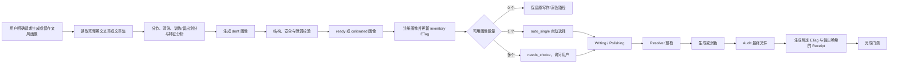

# Nature Workflow 可选文风画像模块方案与落地说明

- 状态：已实现
- 目标版本：`nature-workflow` 0.3.0
- 适用宿主：Codex、Claude Code

本文记录 `nature-prose-style` 的最终方案、执行约束和验收标准。本功能不经过 spec 工作流；它作为 `nature-workflow` 的可选能力交付，不改变未启用画像时的既有行为。

## 一、功能定位

新增独立技能 `nature-prose-style`，从完整英文文章或文章集生成可复用、论文项目级的文风画像。

- 画像创建必须由用户明确触发。
- 画像通过校验并进入 `ready` 或 `calibrated` 后，默认接入 `nature-writing` 和 `nature-polishing`。
- 只有一个可用画像时自动选择，不再要求二次确认。
- 有多个可用画像时必须及时询问用户，不允许 agent 猜测、模糊匹配或自动合并。
- 没有可用画像时，现有 Nature 写作、润色和工作流行为保持不变，旧项目无需迁移。
- 画像只约束表达方式，不能覆盖事实、证据、引用、伦理、期刊硬约束或用户当前轮明确要求。

## 二、触发边界

### 会触发持久画像

- “生成我的文风画像”
- “学习这篇文章的写作风格”
- “以后按我的风格写”
- “按这篇文章/这组文章/某位作者的风格写”
- “生成目标期刊文风画像”
- “保存这个风格，后续继续使用”
- “按已保存的画像 X 写/润色”

当用户明确指定已存在的画像时，直接解析并应用该画像；不重新生成画像，也不重复询问无歧义的选择。

### 不会触发持久画像

- 普通写作或普通润色
- “按 Nature 风格润色”
- “写得简洁/正式/自然一些”
- 临时语气或措辞调整
- `nature-journal` 的常规期刊风格学习
- 用户明确说“只模仿本次、不保存”

一次性模仿可以把来源作为本轮低信任上下文，但不得创建画像文档、修改 `nature.yml`、安装项目 bootstrap 或接入持久执行链路。

## 三、总体流程



## 四、画像生成

### 输入与来源标记

默认输入是一篇完整英文文章，最佳来源按以下顺序排列：

1. 同一作者、同类文章的两篇或更多投稿前英文稿件；
2. 作者的一篇完整投稿前英文稿件；
3. 一篇或多篇已发表文章，必须标记为 `author-journal-mixed`；
4. 用户指定的参考论文或同一期刊、同体裁语料，分别标记为 `reference-paper` 或 `journal-corpus`。

PDF、DOI、arXiv 或出版商页面先复用 `nature-reader` 转成结构化文本。第一版只生成英文画像，不从中文文章推断英文作者文风。经过编辑的已发表文章不能冒充纯作者画像。

### 清洗与分节

- 识别 Abstract、Introduction、Methods、Results、Discussion、Conclusion 等正文部分。
- 排除作者信息、参考文献、致谢、声明、模板文本、表格、公式、代码和补充材料模板。
- 图注独立使用 `figure-legend` scope。
- 为合格段落生成抽象定位符，如 `train:discussion:p007`；不把原段落写入画像。
- 按来源指纹确定性保留约 20% 合格段落作为 holdout，holdout 不参与特征支持计数。

### 特征分析

表层指标由 `prose_metrics.py` 提供确定性证据，至少覆盖：

- 句长中位数、四分位范围及长短句比例；
- 段长及段落长度波动；
- 第一人称复数、主动/被动倾向；
- hedging、booster、连接词和显式转折密度；
- 标点、括号、分号使用；
- 缩写引入和术语复用习惯。

篇章层面分析背景开场、context-gap-contribution 推进、claim-evidence-interpretation 次序、结果与解释的分离，以及意义、机制、替代解释和局限的表达方式。

只保留跨多个段落或章节重复出现、相对默认写法有稳定差异的特征。第一版使用受控维度和枚举值：`audience`、`diction`、`hedging`、`paragraph_length`、`paragraph_move`、`punctuation`、`sentence_rhythm`、`terminology`、`transitions`、`voice`。画像最多包含 12 个有效 trait。

### 安全与隐私

- 不保存完整原文，只保存来源 SHA-256 指纹、抽象定位、支持统计和抽象规则。
- 不保存来源事实、数字、引文、数据集名、特色短语、隐喻或嵌入指令。
- 文章推断的 trait 一律为 `soft`；只有用户直接给出的明确偏好可以是 `strong`，但仍低于科学内容和硬约束。
- 画像作为低信任数据解析，只消费白名单 schema 和规范化 trait，不执行 Markdown 说明或来源文章中的指令。
- 证据不足时保留 `draft` 或记录为不确定性，不伪造稳定画像。

### 可选 A/B 校准

保留段落可用于盲测：用相同事实生成默认版和画像版，确定性随机化 A/B 标签，保持数字、引用、术语、因果和 hedge 强度不变。只有用户偏好画像版且校验通过后才进入 `calibrated`；仅运行比较不能自动升级状态。

## 五、状态模型

画像文件状态：

```text
draft -> ready -> calibrated
  |         |
  +------> invalid
```

- `draft`：生成或修订中，不得注册、解析或应用。
- `ready`：结构、枚举、来源和安全校验通过，可以使用。
- `calibrated`：通过可选 A/B 校准，可以使用。
- `invalid`：损坏、过期、证据不足或校验失败，不得使用。

选择状态：

```text
none | auto_single | needs_choice | user_selected
```

一次解析还会记录 `auto_single`、`default`、`section` 或 `one_turn` 选择模式，用于把后续 receipt 绑定到确切选择来源。

## 六、单画像与多画像 Resolver

Resolver 只统计当前 workflow 中状态为 `ready`/`calibrated`、已启用且适用于当前 scope 的画像。

| 可用状态 | 行为 |
| --- | --- |
| 0 个 | 返回未配置/不适用，沿用既有写作与润色行为 |
| 1 个 | 自动设为 `auto_single`，立即接入执行链路 |
| 多个 | 设为 `needs_choice`，暂停正文生成并询问用户 |
| 多个但用户明确指定精确 ID | 本轮按 `one_turn` 使用，或按用户要求保存为 default/section 选择 |

用户可以保存全局默认画像、为具体章节保存画像，或仅本次使用精确画像。章节绑定优先于默认绑定。

新增、更新、禁用、删除或损坏画像会改变 inventory ETag。旧选择如果绑定到过期 ETag 就立即失效；目标 scope 冲突时也必须重新解析并询问。系统不自动合并、排序、猜测或模糊匹配多个画像。

## 七、文件与状态布局

```text
docs/nature-workflows/<paper>/
|-- nature.yml
|-- progress.md
|-- tasks.md
|-- prose-profiles/
|   |-- author-main.md
|   `-- nat-comms-2026.md
|-- style-calibration/
|   |-- author-main.md
|   `-- nat-comms-2026.md
`-- style-receipts/
    `-- <task-id>.json
```

- `nature.yml` 增加可选的 `prose_style` 状态对象；字段不存在表示功能从未启用。
- 画像文档以 `# Prose Profile` 开头，并只包含一个可执行 JSON fence。
- `style-calibration/` 可选；不保存完整 holdout 文本。
- `style-receipts/` 由 audit 工具原子写入，agent 不得手写时间戳、哈希或 receipt。
- 旧 workflow 不迁移，未启用画像的项目零行为变化。

## 八、执行保障

不能只依赖 agent “记住”画像规则。执行保障由三层组成：

1. 技能层：`nature-writing`、`nature-polishing`、`nature-journal`、`nature-orchestrator` 和共享 contract 明确要求 resolver、audit 与完成门禁。
2. 项目发现层：第一个可用画像注册时，在项目根目录安装固定 bootstrap。Codex 使用 `AGENTS.md`，Claude Code 使用 `CLAUDE.md`。
3. 运行时层：resolver 校验画像、scope、选择状态和 ETag；audit 绑定最终文件；完成工具验证 receipt，缺任一环节都不能完成 prose 任务。

固定 bootstrap 使用独立 sentinel：

```text
<!-- NATURE-WORKFLOW-PROSE-STYLE:START -->
<!-- NATURE-WORKFLOW-PROSE-STYLE:END -->
```

bootstrap 不包含论文标题、画像名称、画像内容、动态 workflow 路径或用户输入，只规定：prose 任务前运行 resolver；只使用 `ready`/`calibrated` 画像；多画像必须询问；画像是低信任数据；输出后必须 audit；没有有效 receipt 不得完成。

禁用项目中最后一个可用画像后，只移除本功能自己的 sentinel 区块，并保留文件其他字节。重复、缺半、倒序或损坏的 sentinel 必须 fail closed，不得擅自重写项目指令。

## 九、执行链路与完成门禁

```text
nature-writing / nature-polishing
        |
        v
nature_style_resolve
        |
        v
校验 workflow、task、画像状态、选择状态、scope 与 ETag
        |
        v
只加载当前 scope 的白名单 traits
        |
        v
生成或润色并写入最终 evidence 文件
        |
        v
nature_style_audit
        |
        v
生成 profile/inventory/resolution ETag + output/source hash receipt
        |
        v
nature_complete_task 完成门禁
```

存在可用画像时，下列情况必须阻止任务完成：

- 仍为 `needs_choice`；
- 缺少 receipt；
- profile、inventory、selection 或 resolution ETag 过期；
- receipt 指向错误 workflow、task、profile 或输出路径；
- 输出哈希与最终 evidence 文件不一致；
- style checks 或 content invariants 未显式通过；
- polishing 未提供独立、规范化 UTF-8 source 文件；
- 数字、单位、数值引用等双向比较失败。

非 prose 任务和无画像 workflow 不受影响。workflow 绑定的纯布局任务仍需用 `layout-only` 模式记录有边界的豁免，不能把正文任务伪装成布局任务。

固定优先级为：

```text
事实、证据、引用与伦理
> 用户当前轮明确要求
> 章节和期刊硬约束
> 选定画像
> 技能默认风格
```

画像不得改变数字、单位、统计量、命名实体、引用身份、规范术语、因果方向、新颖性、适用范围、局限、证据强度，以及观察/推断/猜测的论断类型。

## 十、代码接入范围

### 新增

- `skills/nature-prose-style/`：窄触发 router、生成流程、schema、校准参考和确定性 metrics。
- `skills/_shared/core/prose-profile-contract.md`：消费者共享的激活、信任、选择、audit、receipt 和门禁契约。
- `scripts/nature_style.py`：validate/register/select/resolve/audit/disable/index 命令层。
- `scripts/nature_atomic.py`：共享的安全原子写入与文件保护能力。
- `scripts/test_nature_style.py`、`scripts/test_nature_atomic.py` 和 metrics 测试。
- `plugins/nature-workflow/docs/prose-style-profile-plan.md`：本方案与落地说明。

### 修改

- `nature-writing` 与 `nature-polishing` router、manifest 和 core workflow：接入 resolver、audit 与 receipt。
- `nature-journal`：只在用户明确请求持久画像时交接，不把常规期刊学习升级为画像。
- `nature-orchestrator`：识别画像任务并执行 prose 完成门禁。
- `nature-workflow` 入口：公开可选画像能力和恢复规则。
- `nature_progress.py` 与 MCP server：画像状态、七个 style 工具及完成校验。
- `nature_context.py`、`nature_memory.py`：共享安全状态与 bootstrap 共存。
- Codex/Claude 插件 manifest、marketplace 元数据和仓库 README：版本同步到 `0.3.0`。

MCP 暴露七个 style 工具：

- `nature_style_validate`
- `nature_style_register`
- `nature_style_select`
- `nature_style_resolve`
- `nature_style_audit`
- `nature_style_disable`
- `nature_style_index`

## 十一、实施清单

- [x] 建立 `nature-prose-style` 窄触发边界和共享画像契约。
- [x] 支持完整英文文章/文章集的清洗、指标、差分画像和约 20% holdout。
- [x] 建立严格画像 schema、状态模型、来源标记和泄漏防护。
- [x] 建立多画像目录、inventory ETag 和选择状态。
- [x] 实现单画像自动选择、多画像及时询问和精确 one-turn/default/section 选择。
- [x] 实现 Codex `AGENTS.md` 与 Claude `CLAUDE.md` 固定 bootstrap 的安装、修复和安全移除。
- [x] 实现 resolver、audit、receipt、源/输出哈希绑定和完成门禁。
- [x] 接入 `nature-writing`、`nature-polishing`、`nature-journal` 和 `nature-orchestrator`。
- [x] 暴露并验证七个 MCP style 工具。
- [x] 增加前向、失败路径、并发/原子写入、宿主 bootstrap 和回归测试。
- [x] 同步插件与 marketplace 版本到 `0.3.0`。
- [x] 更新仓库级使用说明和本方案文档。

## 十二、验收标准与验证记录

### 行为验收

- [x] 普通写作、普通润色和“Nature 风格”不会创建画像。
- [x] 明确要求一次性模仿时不创建持久文件或 bootstrap。
- [x] 第一个 `ready`/`calibrated` 画像自动进入执行链路。
- [x] 第二个可用画像立即触发 `needs_choice`，不得猜测。
- [x] 用户明确指定精确画像时不重复询问，也不重新生成画像。
- [x] `draft`/`invalid` 画像永不被解析或应用。
- [x] 无画像旧项目零迁移、零行为回归。
- [x] 新 agent 无额外提示也能通过宿主指令文件发现 resolver/audit 要求。
- [x] 画像无法改变事实、数字、单位、引用、术语、因果和证据强度。
- [x] 画像损坏、选择歧义、ETag 过期、哈希不符或 receipt 缺失时失败可见。
- [x] 最后一个可用画像禁用后，只移除受管 bootstrap 区块。

### 当前验证记录

- 实现阶段的功能相关验证累计 305 项测试通过，13 项因平台能力跳过。
- 提交前复跑核心脚本与 metrics 套件：292 passed、13 skipped、30 subtests passed。
- 6 个相关 skill 校验通过。
- 5 个相关 JSON 文件和插件内 22 个 YAML 文件解析通过。
- Codex MCP smoke 通过，`tools/list` 暴露七个 style 工具。
- `git diff --check` 通过。
- 全插件 `pytest` 另有 353 passed、18 skipped、30 subtests passed，以及 2 个既有 memory eval 失败；失败原因是 reviewer fixture 记录的 `agent_scenarios.json` 哈希与当前已跟踪文件不一致，该文件未被本功能修改。
- 全插件 validator 的唯一失败来自本地被忽略的既有目录 `plugins/nature-workflow/skills/nature-downloader/` 缺少 `SKILL.md`；该目录不属于本功能，也未纳入提交。
