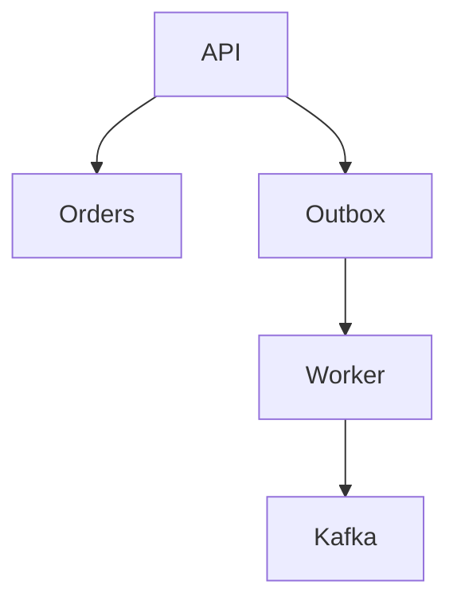

# Design-First 完整使用示例

本文档展示如何从已确定的技术方案出发，生成 `design.md`、派生 `requirements.md`，再拆成任务。

---

## 场景：按 outbox + worker 方案发布订单出站事件

### Intake 与路由

**用户输入：**

> 我们已经决定用 outbox + worker 给订单系统发出站事件。先按这个技术方案做 spec，再决定具体需求和任务。

**智能体响应：**

我读到了Spce workflow技能。
我会先按照“spec-intake”完成需求澄清。

已检查现有订单模块说明和 ADR 草案。用户明确给出 outbox + worker 作为固定技术起点，因此进入 Design-First。

## Spec 路由决定

- 路径：Feature / Design-First
- Design-First 粒度：High Level Design
- Intake 状态：需要反问
- 原因：用户已给出既定技术方案，并要求先从技术设计出发
- 下一步：Design-First 澄清

我会按照“Feature / Design-First”分支来完成。

> [!WARNING]
> 高风险变更警告：当前任务涉及 outbox、worker 与消息投递语义，必须进行人类深度审查，切勿草率合并。

## Design-First 澄清

Round 1 | Target: design-boundaries

1. 订单创建接口、订单表、消息 broker 中哪些契约已经锁定不能改？

**用户回复：**

> 订单创建接口不能改，orders 表可以加字段但不能改主键；broker 是 Kafka。

## Design-First 澄清

Round 2 | Target: success-criteria

1. 出站事件需要满足哪些投递、延迟和幂等性约束？本期明确不处理哪些能力？

**用户回复：**

> 至少一次投递，5 秒内可接受，消费方自己幂等；本期不做事件重放和跨区域复制。

## Intake Handoff / 澄清交接摘要

- Status: complete
- Route recommendation: Design-First
- Confirmed facts: 固定 outbox + worker；Kafka；订单创建接口不可改；orders 可加字段但不可改主键
- Scope: outbox 持久化、worker 发布、Kafka 出站事件、设计派生需求与验证
- Non-goals: 事件重放、跨区域复制、消费方幂等实现
- Decision boundaries: outbox + worker 为锁定方案；实现细节需满足 HLD 约束
- Success criteria: 至少一次投递，5 秒内可接受，事务边界和发布路径测试通过
- Assumptions: n/a
- Risks: 高风险投递语义、事务一致性、重复投递需在 design/tasks 中覆盖
- Next step: 返回 `spce-workflow` 路由。

---

### 规范工件生成

智能体生成：

- `docs/specs/design.md`
- `docs/specs/requirements.md`
- `docs/specs/tasks.md`
- `docs/specs/progress.md`
- `docs/specs/spec.yml`

#### `docs/specs/design.md` 节选

````markdown
> **设计粒度：** High Level Design

## 方案设计

订单 API 在同一事务内写入订单与 outbox 记录；worker 轮询待发送记录并发布到 Kafka。


````

#### `docs/specs/requirements.md` 节选

```markdown
### REQ-001: 订单创建后发布出站事件

- **GIVEN** 订单创建事务已提交
- **WHEN** outbox worker 处理待发送记录
- **THEN** Kafka 中出现符合 schema 的订单创建事件
```

#### `docs/specs/tasks.md` 节选

```markdown
- [ ] **T-001:** 固化 outbox 持久化与 worker 基础约束
  - 状态: pending
  - 验证命令: pytest tests/test_outbox_design.py
  - 验证证据: pending
  - 依赖: 无
  - 风险: high
  - 覆盖: REQ-001
  - 可并行: 否
  - 验证标准：事务边界和发布路径符合 design.md

- [ ] **T-002:** 实现订单创建后的 outbox 写入与事件发布路径
  - 状态: pending
  - 验证命令: pytest tests/test_outbox_publish.py
  - 验证证据: pending
  - 依赖: T-001
  - 风险: high
  - 覆盖: REQ-001
  - 可并行: 否
  - 验证标准：满足 requirements.md 的 GWT 验收标准
```

**智能体输出：**

> 规范工件已生成。请审查 `docs/specs/design.md`、`docs/specs/requirements.md`、`docs/specs/tasks.md`、`docs/specs/progress.md` 和 `docs/specs/spec.yml`。
> 通过校验仍不代表批准实施。确认无误后，请回复 `批准规范，启动执行`。
>
> 兼容旧短语：`批准 design-first 规范，启动执行`。
>
> ```bash
> python plugins/spce-workflow/scripts/validate_spec.py docs/specs/ --workflow design-first
> python plugins/spce-workflow/scripts/spec_progress.py init docs/specs/
> python plugins/spce-workflow/scripts/validate_spec.py docs/specs/ --resume
> ```

**用户回复：**

> 批准规范，启动执行

**智能体：**

> 已收到批准，先冻结已批准设计、派生需求和任务计划基线。

```bash
python plugins/spce-workflow/scripts/spec_progress.py approve docs/specs/ --evidence "批准规范，启动执行"
```

---

## 关键要点

1. Design-First 的真实来源是固定技术方案，不是普通需求换个名字。
2. 先选择 High Level Design 或 Low Level Design。
3. `requirements.md` 必须从 `design.md` 派生，不能扩大产品范围。
4. 实现中若发现设计冲突，必须运行 `sync-check --write` 标记 `reapproval-required`，回到规范阶段并重新获得批准后再运行 `approve`。
5. 批准后 `design.md`、`requirements.md` 和任务计划被冻结；任务开始/完成只能用 `spec_progress.py` 或 MCP 工具更新进度字段、`progress.md` 和 `spec.yml`。
